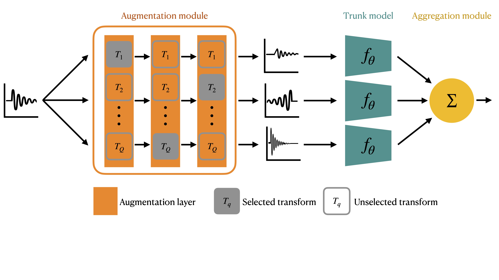

# AugNet

This repository contains the code used in the experiments of _Rommel, Moreau and Gramfort, ["Deep invariant networks with differentiable augmentation layers"](https://arxiv.org/abs/2202.02142), NeurIPS, 2022_.



---

## Getting started

Start by cloning the repository:
```bash
git clone https://github.com/cedricrommel/augnet.git
```

### Requirements

This work depends on the following packages:
- pytorch>=1.8.0
- torchvision>=0.11.1
- kornia>=0.6.3
- scikit-learn
- numpy
- pandas
- scipy
- matplotlib
- seaborn
- pytest

The EEG experiments (not yet available) further require:
- MNE Python
- Skorch
- Braindecode

All depedencies can be installed into a new environment using [Anaconda](https://www.anaconda.com/products/distribution) by running:
```bash
conda env create -f environment.yml
conda activate augnet
```
from the package root directory.

### Other prerequisites

After installing the necessary requirements, you should install the package
itself. For this, go to the root directory of the package and run
```bash
pip install -e .
```

## How to create your own AugNet meta-model

You can create augmentation layers using the ``augnet.models.AugmentationLayer``
class, by passing to it a list of differentiable augmentations, such as those
in the module ``augnet.augmentations.vision``:

```python
from augnet.augmentations.vision import (
    TranslateX,
    TranslateY,
    ShearX,
    ShearY,
    Rotate,
)

from augnet.models import AugmentationLayer

n_layers = 3
init_mag = 0.1
fixed_prob = 1.0

aug_layers = list()
for _ in range(n_layers):
    # create augmentations
    augmentations = [
        TranslateX(
            initial_magnitude=init_mag,
            initial_probability=fixed_prob,
        ),
        TranslateY(
            initial_magnitude=init_mag,
            initial_probability=fixed_prob
        ),
        Rotate(
            initial_magnitude=init_mag,
            initial_probability=fixed_prob,
            magnitude_scale=180
        ),
        ShearX(
            initial_magnitude=init_mag,
            initial_probability=fixed_prob
        ),
        ShearY(
            initial_magnitude=init_mag,
            initial_probability=fixed_prob
        ),
    ]

    # create layers
    aug_layer = AugmentationLayer(
        augmentations=augmentations,
        temperature=0.01,
    )
    aug_layers.append(aug_layer)
```

A list of augmentation layers can be grouped into an ``AugmentationModule`` as follows:
```python
from augnet.models import AugmentationModule

aug_module = AugmentationModule(aug_layers)
```

The latter can be used to wrap any trunk model using the ``AugAveragedModel`` class, in order to create an AugNet meta-model:
```python
from augnet.models import AugAveragedModel, SimpleMLP

trunk_model = SimpleMLP(
    n_neurons=10,
    n_layers=3,
    in_shape=32*32*3,
    num_classes=4,
)

# create augnet
augnet = AugAveragedModel(
    model=trunk_model,
    aug=aug_module,
    ncopies=4,
)
```
The obtained model can be trained seemlessly as any other pytorch model.

## Running paper experiments

### Mario and Iggy

Mario and Iggy experiment code (section 4.1) can be found in 
`./experiments/mario_iggy`. To reproduce the paper experiments, just move to
that folder and execute
```bash
bash run_experiments.sh
```

Figures will be plotted and saved into `./experiments/mario_iggy/figures/`,
while outputs used to create them are stored in
`./experiments/mario_iggy/saved-outputs`.


### Sinusoids

Sinusoids experiments (section 4.2 and 4.3) can be found in 
`./experiments/sinusoids`. To reproduce the paper experiments, just move to
that folder and execute
```bash
bash run_experiments.sh
```

Figures will be plotted and saved into `./experiments/sinusoids/figures/`,
while outputs used to create them are stored in
`./experiments/sinusoids/saved-outputs`.


### CIFAR10

CIFAR10 experiments code (section 5.1) can be found in `./experiments/cifar10`.
To reproduce the baselines from the paper, move there and execute
```bash
bash run_experiments.sh $DEVICE
```
where `$DEVICE` is the device you want to run the training on (e.g. `cuda:0`).

Training can take a lot of time though as they are not parallelized here (~45h for the baselines and ~20h for Augnet).

Figures will be plotted and saved into `./experiments/cifar10/figures/`, while outputs will be stored in `./experiments/cifar10/saved-outputs`.


### MASS

MASS experiments code (section 5.2) can be found in `./experiments/mass`.

**Unfortunately, this experiment still cannot be reproduced since it relies on a package that was not yet publicly released. This repository will be updated as soon as the situation changes.**

<!-- To train the AugNet model from the paper, move there and execute
```bash
bash run_augnet.sh $DEVICE
```
Outputs will be stored in `./experiments/mass/saved-outputs`.

To run this experiment, the package `eeg-augment` needs to be installed locally and you need access to the public dataset MASS. Refer to the corresponding ReadMe file for more info. -->

## Citation

If you use the code in this repository, please consider citing:
```
@inproceedings{rommel2022deep,
    title={Deep invariant networks with differentiable augmentation layers}, 
    author={Rommel, C\'edric and Thomas Moreau and Alexandre Gramfort},
    year={2022},
    booktitle={{Advances in Neural Processing Systems (NeurIPS)}},
}
```

## Credit

The differentiable computer vision augmentations in this repository were copied and modified from https://github.com/moskomule/dda and the Augerino model together with a few other pieces are strongly inspired by https://github.com/g-benton/learning-invariances.
